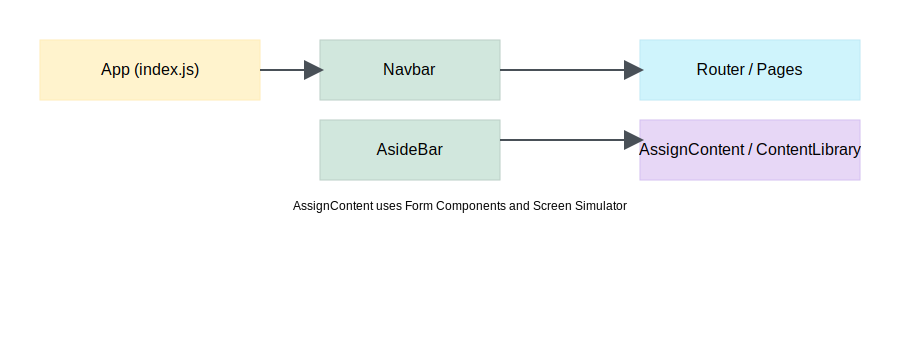
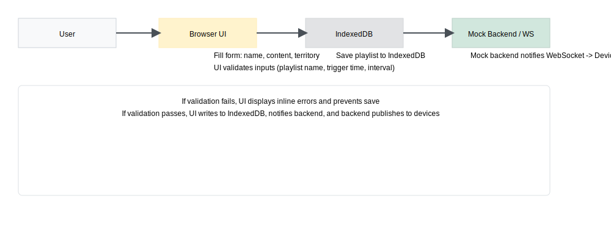

# Ad Console — Comprehensive README ✅

An admin front-end application for managing playlists, content, and devices for digital signage. This Repo is a Create React App project that uses IndexedDB for local persistence and mock services for backend and realtime behavior.

---

## Table of Contents
- Overview
- Quick Start
- Key Pages & Functionality
  - Dashboard
  - Content Library
  - Assign Content (Playlist Creator)
  - Manage Playlists
  - Device Management
  - Device-Store Mapping
  - Display Player (Monitor / Device Preview)
- Important Components
- Services & Data Storage
- Common Flows (Create-Approve-Assign-Play)
- Validations & Business Rules
- Development Notes & Tips
- Contributing
- Appendix: Useful paths

---

## Overview
This project is an admin UI for creating and assigning multimedia content (images, videos, slideshows) to digital signage screens (devices). The app is offline-capable using IndexedDB with a mock backend and mock WebSocket for demonstrating runtime behaviors.

Key behaviors:
- Create content (images/videos) and manage the media library.
- Create Playlists including a regular or trigger-based mode.
- Assign playlists to territories: country, state, city or directly to store IDs.
- Device management and pairing, configuration of orientations and resolutions.
- Device-to-store mapping and bulk assignment (file import/export).
- Simulated device playback (Display Player) for monitoring and preview.

💡 Tip: Because this runs locally with IndexedDB and mock services, you can try flows without a real server.

---

## Quick Start ⚡
1. Install and run

```powershell
npm install
npm start
```

2. Open: http://localhost:3000

3. Key local storage used: `customContent` and a small IndexedDB store (via `services/indexeddb.js`). You can clear site storage to reset state during development via your browser Developer Tools (Application > Clear Storage).

---

## Key Pages & Functionality (Detailed) 🗺️

Note: The main pages are in `src/pages/`.

### Dashboard
- File: `src/pages/Dashboard/Dashboard.jsx`
- Purpose: High-level overview of the system. Shows quick actions and summary metrics (Total Screens, Active Screens, Content Items, Active Assignments).
- Features:
  - Cards for quick metrics with counts fetched from AppContext, indexed DB and devices.
  - Quick links to Content Library, Assign Content, and Monitor/Display Player.
  - Recent assignments table with delete action.

Usage & Flow:
- Use quick cards to jump to content management and assign flows.
- Use the Recent Assignments table to view or delete assignments.

### Content Library
- File: `src/pages/ContentLibrary/ContentLibrary.jsx`
- Purpose: Manage the media assets for displays.
- Features:
  - Add new content: upload images or videos (multiple), create a content record with slides and metadata.
  - Edit existing content: append slides (images or videos), remove slides, preview content.
  - Disable (permanently) content.
  - Auto-detection of image/video dimensions and video durations for upload validation.
  - Device resolution matching (recommended) to ensure content matches available device profiles.

Developer notes:
- New content is stored in IndexedDB via `services/indexeddb.js`.
- The page prevents mixing images and videos in the same content object: either all images (slides) or videos.

### Assign Content — Playlist Creator
- File: `src/pages/AssignContent/AssignContent.jsx`
- Purpose: Create, edit, clone, view and save playlists that target regions or individual stores and schedules.
- Key Features:
  - Territory selection: Country / State(s) / City(ies) / Store(s)
  - Store selection: either a filtered selector (React-Select Async dropdown) or comma-separated `IN...` store IDs
  - Content selection: associate single or multiple content items with a playlist and set durations per slide
  - Dates: Start and End Date controls for playlist validity (endDate limited to 1 year after start)
  - Playlist Types: `regular` or `trigger` (`trigger` supports subtypes; currently `time`)
  - Trigger subtype `time`: shows Start At and Stop At controls (12-hour) and Trigger Interval (minutes, multiples of 5, minimum 5)
  - Preview of each content slide and basic heuristics/validation when selecting durations
  - Save behavior: when editing an approved playlist, saving creates a draft copy that references the original playlist. This prevents overwriting approved records and supports an approval flow.

Flow & Validation details:
- Trigger subtypes: The UI only shows time controls if `trigger` + `time` subtype is chosen. Interval must be >= 5 and is rounded to the nearest lower multiple of 5.
- Time windows: Start must be earlier than Stop; crossing midnight is not allowed.
- Playlist save: Must provide a playlist name, choose content, and valid date range. When saving an edited playlist that was approved, a draft is created and the original playlist is disabled while the draft is pending.

### Manage Playlists
- File: `src/pages/ManagePlaylists/ManagePlaylists.jsx`
- Purpose: View, edit, approve/reject, clone playlists across various states (Created, Approved, Rejected, Inactive/Expired).
- Features:
  - Tabs for Created/Added, Approved, Rejected, and Expired playlists.
  - Search and filters by name, region, store ID.
  - Actions: Edit, View, Approve, Reject, Clone.
  - Approved playlists can show a pending draft flag if they’re being edited.
  - Approving causes drafts to replace the original and updates `disabledWhileEditing`, `pendingDraftId`, and `replacedBy` fields to keep state consistent.

### Device Management
- File: `src/pages/DeviceManagement/DeviceManagement.jsx`
- Purpose: Define device hardware configurations and manage device models.
- Features:
  - Create / Clone / Configure devices with Name, Orientation (both/landscape/portrait), and Resolution (width/height in px)
  - Edit device details, including MAC address validation when configuring physical devices
  - Disable/enable devices (with safeguards for assigned devices)
  - Device table lists available devices, their orientations, and actions
  - Option to clone devices and a preview of current configuration values

Developer Notes:
- Device orientation change has an auto swap behavior that swaps resolution width/height appropriately.
- Device MAC address input validates typical MAC address format (xx:xx:xx:xx:xx:xx).

### Device-Store Mapping (Assign devices to store IDs)
- File: `src/pages/DeviceStoreMapping/DeviceStoreMapping.jsx`
- Purpose: Map actual device instances (each with a MAC address and DeviceID) to store IDs.
- Features:
  - Assign a device to a store using an inline assign form (select store → assign devices with MAC)
  - Upload assignments via spreadsheet (XLSX). The uploaded template maps columns such as Store ID, Device, MAC Address, Orientation.
  - Export current assignments as XLSX with a formatted header row
  - Bulk assign or delete assignment records from IndexedDB
  - Provide a List View (per store) and inline edit modes with Save Changes that persist to IndexedDB

Notes:
- The file upload robustly parses the spreadsheet and will report devices that aren’t found (invalid names in the sheet).

### DisplayPlayer (Device Monitor / Pairing UI)
- File: `src/pages/DisplayPlayer/DisplayPlayer.jsx`
- Purpose: Simulate a device display and monitor playback behavior. This is the runtime view a real display would run and pair to the admin console.
- Features:
  - Pairing state: if a device is not assigned to a store, it shows a Pairing Code and pairing instructions.
  - If paired and content exists, it cycles through playlist content (images, slideshows and videos) using durations.
  - Uses `mockBackend` and `mockWebSocket` to simulate assignment updates and heartbeat events for devices.
  - Automatic reloads when a content update arrives via the mock WebSocket.

Flow:
- When opening a URL such as `/display/:deviceId` the Display Player reads the local mock backend; if the device has pairing info and is connected it will fetch assigned content; otherwise it shows pairing instructions.

---

## Important Components 🧩
- `src/components/common/AsideBar/AsideBar.jsx` — Site left navigation (collapsible)
- `src/components/common/Navbar/Navbar.jsx` — Top nav bar with branding and user actions
- `src/components/ContentCard/ContentCard.jsx` — A small content card component used across pages to present media items
- `src/components/ScreenSimulator/ScreenSimulator.jsx` — A simulated screen preview used in the Monitor/Display player
- `src/components/SlideshowPlayer/SlideshowPlayer.jsx` — A simple slideshow player component used within the Display Player and previews
- `src/components/LocationSelector/LocationSelector.jsx` — Multi-level selection for state/city filtering and custom store ID filtering

---

## Services & Data Storage 🔧
- `src/services/indexeddb.js` — Wrapper around IndexedDB used for storing content and playlists. Key ObjectStores used:
  - `playlists` — Playlist records (including trigger config, region filters, status, and draft relationships)
  - `content` — Media content, slides array, duration, and metadata
- `src/services/deviceIndexeddb.js` — Device and assignment records stored in IndexedDB
- `src/services/mockBackend.js` — Simulated backend for assignments and devices
- `src/services/mockWebSocket.js` — Simulated WebSocket behavior for device updates and push notifications

Important data shape notes:
- Playlist schema includes: id, playlistName, type (`regular` | `trigger`), triggerSubType, triggerInterval, triggerStartAt, triggerStopAt, territoryType, selectedState/City/Store lists, regionNomenclature, selectedContent (array of content ids), startDate, endDate, status, disabledWhileEditing, draftOf
- Content schema includes: id, title, slides (each slide has type, width, height, data / dataUrl), duration for start-of-item duration (video top-level), active flag
- Device assignments: assignment records contain storeId, deviceId, macAddress, orientation, assignmentId, and active flag

---

## Common Flows & Examples ⚙️

1) Create content and Playlist & Assign to stores
  - Create content in Content Library: Add Content → upload images/videos (ensure orientation and sizes fit available devices) → Save
  - In Assign Content: Select territory (Country / State / City / Store), add content by selecting content from dropdown and set duration, choose start and end dates, choose playlist type (regular/trigger), set trigger if needed, and save.
  - If a playlist is saved and set to status `pending`, use Manage Playlists → Approve to move it to `approved`.

2) Approve / Edit flow with Drafts
  - If you edit an `approved` playlist, saving creates a *draft* record which references the original playlist (draftOf). The original is disabled while the draft is pending; approving the draft replaces the original and marks it `inactive` and the draft becomes the new approved.

3) Assigning devices to a store
  - Use Device Management to add device models and configure orientation and resolution.
  - Use Device-Store Mapping to assign a device instance (with MAC and ID) to a store — can be added inline or via XLSX upload.
  - Device display is monitored via Display Player (if display is paired) and playlist content updates are delivered to the mock websocket.

4) Monitor & Pair a Display
  - Open `/display/{deviceId}` to run a simulated device. If it’s not paired to a store, a pairing code is shown. Pairing in the Device Management UI will link that device to a store.

---

## Validations & Business Rules ✅ / ⚠️
- Trigger interval: Must be >= 5 and rounded down to nearest multiple of 5 — the UI clamps inputs accordingly.
- Time window: Start must be earlier than Stop. Crossing midnight is disallowed for time-based triggers.
- Duration: For videos, the playlist duration must not exceed the length of the video; the UI prevents adding durations longer than the video's duration.
- Store ID pattern: Manual store IDs must begin with `IN` and be alphanumeric. Valid IDs must exist in `src/data/storeList.js`.
- End Date: Must not be earlier than the start date. EndDate cannot be more than 1 year from plus StartDate.
- Content media type: Content entries should be either images or videos (not mixed) to avoid media-type mismatch.
- Device MAC Address: Validated as the format `XX:XX:XX:XX:XX:XX` (hex).

---

## Developer Notes & Tips 🛠️
- The app uses IndexedDB for persistence; consider `services/indexeddb.js` for helpers. The file abstracts adding, updating, and retrieving records.
- Mock APIs and WebSocket are in the `services` folder, which you can use or disable when integrating a real backend.
- Replace static external images with local assets in `src/assets/images` to avoid runtime bundling issues — this is recommended for production builds.
- For unit tests, pay attention to `src/pages/AssignContent/AssignContent.test.jsx` test scaffold.
- To reset test data: open DevTools → Application → IndexedDB and delete `ad-console-db` or clear storage.

Performance tips:
- Avoid huge media uploads in the dev environment; the content is stored as data URLs in IndexedDB which can grow large quickly.
- Use smaller media for quick iterations during UI development.

---

## Contributing
- Add unit tests for critical flows ( AssignContent push validation & time windows )
- Make sure mock services are extended for new trigger types (e.g., sensor or event triggers).
- Keep consistent naming in playlists and device IDs — use uppercase `IN` prefix for store IDs.

PR Checklist:
- Add/Update tests for the changes. Run `npm test`.
- Lint and run `npm test` before opening a PR.
- Keep the UI accessible and validate mobile/responsive states for page layouts.

---

## Appendix: Useful files & paths 📁
- App entry: `src/index.js`
- Assign Content/Playlist Creator: `src/pages/AssignContent/AssignContent.jsx`
- Content Library: `src/pages/ContentLibrary/ContentLibrary.jsx`
- Manage Playlists: `src/pages/ManagePlaylists/ManagePlaylists.jsx`
- Device Management: `src/pages/DeviceManagement/DeviceManagement.jsx`
- Device-Store Mapping: `src/pages/DeviceStoreMapping/DeviceStoreMapping.jsx`
- Display Player (device simulator): `src/pages/DisplayPlayer/DisplayPlayer.jsx`
- IndexedDB helper: `src/services/indexeddb.js`
- Device IndexedDB helper: `src/services/deviceIndexeddb.js`
- Mock backend / websocket: `src/services/mockBackend.js`, `src/services/mockWebSocket.js`

---

If you'd like, I can also:
- Add a CONTRIBUTING.md and PR template to standardize contributions.
- Create a short quick-start developer script or README section to make it easier for new developers to onboard.
- Add example CSV/XLSX templates for device mapping stored under `docs/`.

---

Made with ❤️ in the Ad Console repository.
# Ad Console — README

This repository contains the Ad Console front-end application — a React app (Create React App) used to manage content, playlists and devices for digital signage.

**Primary goals:**
- Provide a compact admin UI to create and assign playlists.
- Manage devices, device-store mapping and monitor displays.
- Support scheduled/time-based triggers (and extensible trigger types).

**Tech stack:**
- React (Create React App)
- React Bootstrap + react-select
- IndexedDB (local browser DB) for persistence (`services/indexeddb.js`)
- Mock WebSocket / Mock backend utilities for development (`services/mockBackend.js`, `services/mockWebSocket.js`)

**Repository layout (key files & folders):**
- `src/`: application source
	- `components/`: reusable React components (Sidebar, Navbar, Cards, Simulators)
	- `pages/`: page-level views (AssignContent, ContentLibrary, DeviceManagement, Monitor, etc.)
	- `services/`: IndexedDB helpers, mock backend and websocket helpers
	- `data/`: sample/mock data (e.g. `storeList.js`)
	- `context/`: app-level context and providers (`AppContext.js`)
	- `utils/`: helper utilities
- `public/` and `build/`: static and build output
- `netlify.toml`: Netlify deployment hints (project includes Netlify configuration)

**How the app works — high level flow**
- User logs in (if auth is added) and navigates the admin console UI.
- Main flows:
	- Create playlists (`pages/AssignContent/AssignContent.jsx`): select content, set territory, scheduling/trigger options and assign to stores.
	- Manage content (`pages/ContentLibrary`): upload, preview, and organize media.
	- Device management (`pages/DeviceManagement`): add displays, map to stores, pair devices.
	- Monitor (`pages/Monitor`): view live preview/status of devices.

	**Data flow & persistence**
	- The app stores playlists, content metadata and device info in an IndexedDB database via `services/indexeddb.js`.
	- For development/demo, the project includes `services/mockBackend.js` and `services/mockWebSocket.js` to simulate server APIs and live device connections.
	- When a playlist is saved, it is written to the `playlists` ObjectStore (see `PLAYLIST_STORE` constant in `AssignContent.jsx`).

	**Playlist / Trigger design**
	- Playlists can be of type `regular` or `trigger`.
	- For `trigger` playlists the UI now shows a Trigger Type dropdown first (e.g. "Time-based trigger"). Only after selecting a trigger subtype (like `time`) are the time-related controls (interval, start/stop) shown. This keeps the model extensible for future trigger types (sensor/event).

	**Key components**
	- `src/components/common/AsideBar/AsideBar.jsx` — left nav with collapsed/expanded states; logo now uses an image for the brand.
	- `src/pages/AssignContent/AssignContent.jsx` — main playlist creation UI; handles validation, prefill for edit/clone flows and saving to IndexedDB.
	- `src/services/indexeddb.js` — IndexedDB helpers used across pages to persist playlists and content.

	**Development / Running locally**
	- Install dependencies and start the dev server:

	```powershell
	npm install
	npm start
	```

	- App will be available at `http://localhost:3000` by default.

	**Build / Deployment**
	- Create a production build:

	```powershell
	npm run build
	```

	- The `build/` folder is ready for static hosting. The project contains a `netlify.toml` file for deploying on Netlify; you can drag the build output to another static host if required.

	**Testing**
	- The project includes React test scaffolding. Run tests using:

	```powershell
	npm test
	```
**Notable behaviors & validations**
- Trigger interval: when using time-based triggers the interval is enforced to be >= 5 and rounded down to the nearest multiple of 5.
- Time window: the Start time must be strictly earlier than Stop (no crossing midnight allowed). The UI shows inline validation messages for invalid time windows.
- When editing an approved playlist, saving creates a draft instead of overwriting the approved record (the code sets `draftOf` / `disabledWhileEditing` fields accordingly).

**Local assets recommendation**
- In development we reference some images via external URLs. For production reliability, add images to `src/assets/images/` and import them (e.g. `import logo from 'src/assets/images/logo.png'`) so bundling includes them and avoids external network dependencies.

**Troubleshooting**
- If the dev server fails to start, run `npm install` then `npm start` and check the terminal for missing dependencies.
- IndexedDB errors generally mean schema mismatch — clear site data in the browser (Application → Clear Storage) while developing schema changes.

**Contributing / Next steps**
- Add unit tests for critical flows (AssignContent trigger validations, IndexedDB helpers).
- Implement real backend APIs and replace mock services in `services/` when a server is available.
- Add feature flags for trigger subtypes and implement sensor/event trigger UI when devices provide telemetry.

**Useful paths**
- App entry: `src/index.js`
- Playlist UI: `src/pages/AssignContent/AssignContent.jsx`
- IndexedDB helpers: `src/services/indexeddb.js`
- Mock backend: `src/services/mockBackend.js`
- Sidebar component: `src/components/common/AsideBar/AsideBar.jsx`

---

If you'd like, I can also:
- Generate a short architecture diagram or a developer quick-start checklist.
- Add a CONTRIBUTING.md and a PR template.

## Detailed Project Explanation and Diagrams

The following sections explain how this project is structured, how the main flows operate, and why certain design decisions (like IndexedDB and mock services) were made. The diagrams use Mermaid markup which renders on GitHub and many editors. If your editor doesn't render Mermaid, you can use online Mermaid live editors.

### 1) High-level architecture

This diagram describes the main runtime components and how they interact at a high level.

View diagrams as images here:


Notes:
- The app is a client-side React Single Page App (SPA). For development and demo, it uses local mock services and local persistence in IndexedDB.
- `MockBackend` and `MockWebSocket` simulate server API behavior and streaming push notifications to devices.

### 2) Component and page relationship

This diagram shows the major components and where they are used in the page structure.



### 3) Playlist lifecycle (data flow)

This sequence diagram shows a typical playlist creation and assignment flow with validation and save.



### 4) Trigger subtype and conditional UI behavior (time-based triggers)

Key points:
- When a playlist is `trigger` type, the UI shows a dropdown to select the trigger subtype (e.g., `time`).
- Only if the subtype is `time` do the UI controls for interval `triggerInterval` and Start/Stop times appear.
- Validation applies only for the time-based subtype: Start must be earlier than Stop and the interval must be at least 5 minutes.

### 5) Important files and roles

- `src/pages/AssignContent/AssignContent.jsx` — core page for creating playlists; handles:
	- Form inputs and validation
	- Trigger subtype logic and validation of time windows
	- Prefill logic for edit/clone flows and `view` permission
	- Save flow that writes to IndexedDB and optionally notifies mock backend
- `src/services/indexeddb.js` — wrapper functions for a simple IndexedDB interface; used across the app to persist and read content and playlists
- `src/services/mockBackend.js` — simulated backend API handlers used during development
- `src/services/mockWebSocket.js` — provides a WebSocket-like interface to send updates to device simulators
- `src/components/common/AsideBar/AsideBar.jsx` — site sidebar and navigation (collapsible)
- `src/components/common/Navbar/Navbar.jsx` — top bar (branding, user actions)

### 6) Common patterns and design decisions

- Use IndexedDB for local persistence to simulate real backend data and to make the developer experience offline-friendly.
- Mock backend and mock WebSocket provide realistic interactions so front-end workflows can be tested without a remote server.
- The app uses `react-select` for rich selects and `react-bootstrap` for general UI layout and components.
- Trigger subtype design allows adding more trigger types (e.g. `sensor`, `event`) later without major UI changes.

### 7) Device simulation / Monitor

- `src/pages/DisplayPlayer` and `src/components/ScreenSimulator` / `SlideshowPlayer` provide preview UI and simulated playback. These rely on the mock WebSocket to receive updates that would otherwise come from a real backend.

### 8) Developer workflow

- Start dev server:
```powershell
npm install
npm start
```
- Running the dev server serves the React app and provides hot-reload for UI changes.
- Tests: `npm test`, Build for production: `npm run build`.

---

If you’d like, I can also:
- Add SVG or PNG diagrams under `docs/` for non-Mermaid rendering editors
- Convert the Mermaid diagrams into PNG or SVG files and commit them under a new `docs/` folder
- Add a developer quick-start checklist for contribution and debugging common issues


